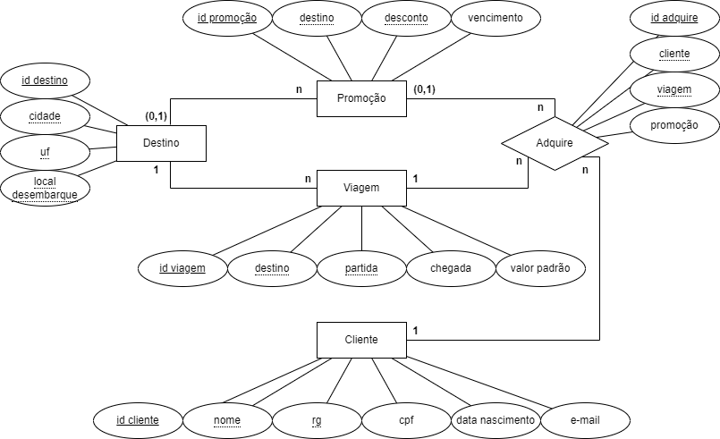

# Projeto Agência de Viagens - Recode Pro 2021
## BlueBird Viagens - v3
### Desenvolvedor: Vítor Mateus Santos Parreiras

Desenvolvimento de um site para clientes realizarem cadastro e aquisições de viagens de uma agência fictícia chamada **BlueBird Viagens**. Versão 3: ReactJS, Spring, PostgreSQL.

<div align="center">
  
</div>

#### Modelagem Entidade-Relacionamento


#### Instalação e Configuração

###### 1. Banco de dados
1. Será necessário ter o PostgreSQL instalado e sem um banco de dados de nome *agenciaviagens*.
2. Rode o script banco-de-dados/criarBD.sql no PostgreSQL.

###### 2. Backend
1. Na sua IDE (Eclipse, STS, etc), adicione o projeto existente na pasta backend/bluebird ao seu workspace.
2. Renomeie o arquivo backend/bluebird/src/main/resources/application.properties.sample para 'application.properties', depois insira seu usuário e senha do PostgreSQL nas linhas 2 e 3.
```
spring.datasource.username=
spring.datasource.password=
```
3. Rode a aplicação java para que as tabelas sejam criadas no banco de dados.
4. Rode o script banco-de-dados/popularBD.sql no banco de dados *agenciaviagens* já criado no PostgreSQL.

###### 3. Frontend
1. Execute o comando abaixo na pasta frontend para instalar as dependencias do React:
```
npm install
```

#### Execução
Inicie o banco de dados PostgreSQL e a aplicação java na sua IDE e execute um dos comandos abaixo na pasta frontend para rodar o React:
```
npm start
```
ou

```
yarn start
```
Após todas as aplicações iniciarem corretamente, o sistema estará em funcionamento e você poderá visualizar o resultado no link http://localhost:8080.